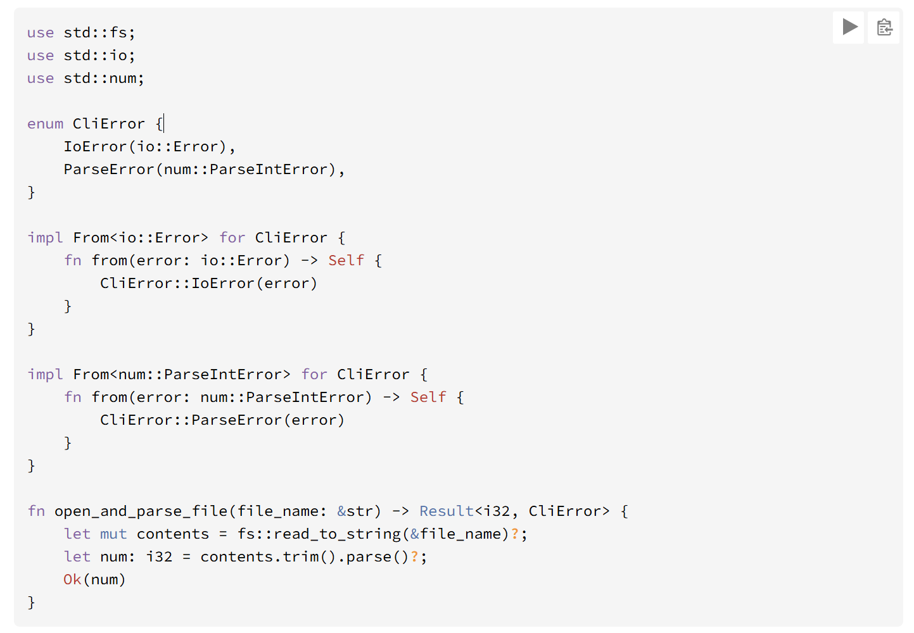
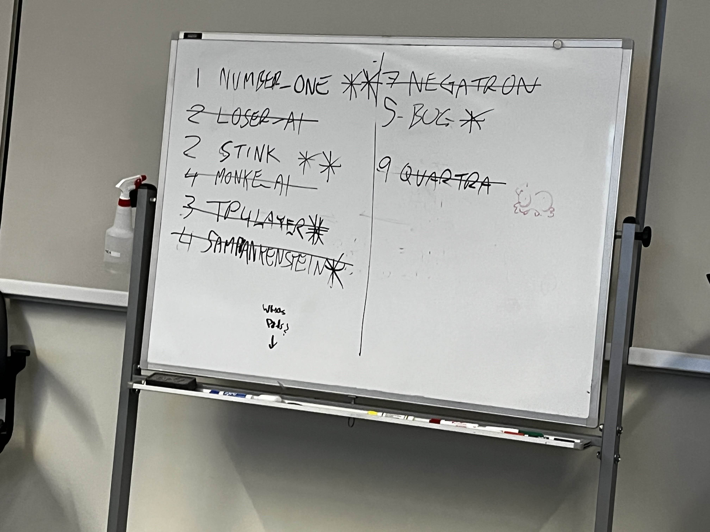

# The Connect 4 Attempt

So I apparently made a Connect 4 AI that got second place in a competition between other connect 4 AI...

Let's talk about that~~~

## But first, a mandatory pre-reading

Whilst I do my best to not procrastinate, a beautiful array of life events occurred within the span of the course of development of this project. All of which lead to roughly ~%90 of the work getting done the night/morning the work was due.

In turn, my rival being in-line documentation is no where to be seen once more.

### Here's a lil fun aside whilst we're in the pre-reading

***I despise using four separate coding languages within a small time frame***

The main two culprits relevant to the situation are C++ and Rust

I can't stress that it got to a point where I forgot that I literally can just, cast types without needing to do this extra stuff that's needed if one is trying to type cast in rust



*So I'll be make sure to google more when coding...*

## Anyways, winning through spines

When coding the win check for normal game play, I made sure to utilize built in functions to make the act of checking each location, alongside any pieces that would allow any win, easier to implement!

In order to do so, I use the chess square system to have a reference of both the square we're looking at, and the square we want to check.

In practice, it looks like this:

```
ChessSquare* at_square = _grid->getSquare(x, y);

if (at_square->bit() == nullptr) {
    continue;
}

// std::cout << "found a piece" << std::endl;

ChessSquare* squareToCheck = at_square;

// check right

for (int i = 0; i < 3; i++) {
    
    // safety checks

    if(squareToCheck->getColumn() + 1 >= _gameOptions.rowX) {
        break;
    }

    // grabs a ref to the new chess square
    squareToCheck = _grid->getE(squareToCheck->getColumn(), squareToCheck->getRow());

    // checks if it has a player
    if(squareToCheck->bit() == nullptr) {
        break;
    }
    
    // break if at any point the elements don't match up
    if (at_square->bit()->getOwner() != squareToCheck->bit()->getOwner()) {
        break;
    }

    // Win check
    if(i == 2) {
        return at_square->bit()->getOwner();
    }

}
```

I will note, this is the cleaner code, because it uses a lot of built in helper functions that come with the checker square.

The same can not be said for the ai portion of the code being...

## this...

```
int Connect4::checkForAIWinner(const std::string &state, const GameOptions &_gameOptions, int target) {

    int amountToReturn = 100;

    for (int y = 0; y < _gameOptions.rowY; y++) {
        
        for (int x = 0; x < _gameOptions.rowX; x++) {

            if (state[y * _gameOptions.rowX + x] == '-') {
                continue;
            }

            // Checks horizontals

            if (x + 3 < _gameOptions.rowX) {

                // check right

                if (
                    (state[y * _gameOptions.rowX + x] == state[y * _gameOptions.rowX + x + 1]) &&
                    (state[y * _gameOptions.rowX + x] == state[y * _gameOptions.rowX + x + 2]) &&
                    (state[y * _gameOptions.rowX + x] == state[y * _gameOptions.rowX + x + 3]) &&
                    (state[y * _gameOptions.rowX + x] != '-') 
                ) {

                    return amountToReturn;

                }

                ...

            }
        }
    }
}
```

That is just a sliver of my check for AI winner code. This section of code frankly is a solid, yet still messy, implementation of how I check for wins when I was working on TicTacToe.

Inherently, I could also make a for loop for each kind of possible win; North East, East, South East, South; however, this frankly gets the job done.

How do I know it works?



I rest my case

> I know the "it works" is not a good mindset, I plead 5 AM and that this is the only time I'll be touching and updating the solution/repository

In all seriousness, there's one extra element that I worked on that assisted in the success of this AI.

## The Weight Map/Table

This was the extra spice I added that took my Connect4 AI from just a standard AI, to one that would, unintentionally, get more wins by prepping itself for possible wins in the future.

So, this is the weight table in question

```
const int WEIGHT_TABLE[6][7] = {
    {3, 4, 5, 7, 5, 4, 3},
    {4, 6, 8, 9, 8, 4, 4},
    {5, 8, 11, 13, 11, 8, 5},
    {5, 8, 11, 13, 11, 8, 5},
    {4, 6, 8, 9, 8, 4, 4},
    {3, 4, 5, 7, 5, 4, 3},
};
```

When looking at places where a piece would then be placed, I made sure to incorporate the target drop location from the weight table into the calculation, in order to make sure that the potential  spot is the best possible location.

However, I also made sure to keep it so that the elements within the weight table do not outweigh the value of any AI winning the game. In turn, I went ahead and increased the value of a win in my checkForAIWinner function!

## All in all...
This is more of a short and sweet version of my standard READMEs, due to the fact that a lot of this work is just, tic-tac-toe, but again.

Nevertheless, it was a fun assignment to say the least, and helped reestablish cpp concepts and workflows, as well as the development of AI systems in games!

So yeah...

toodles!